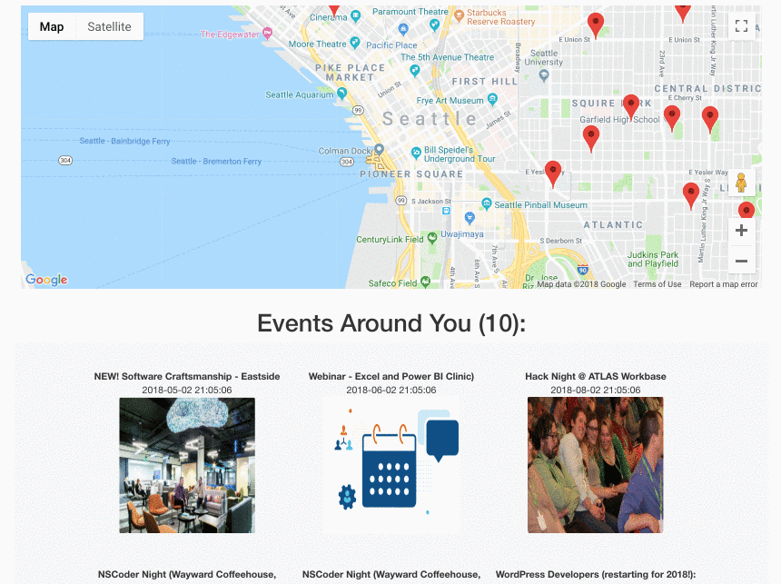
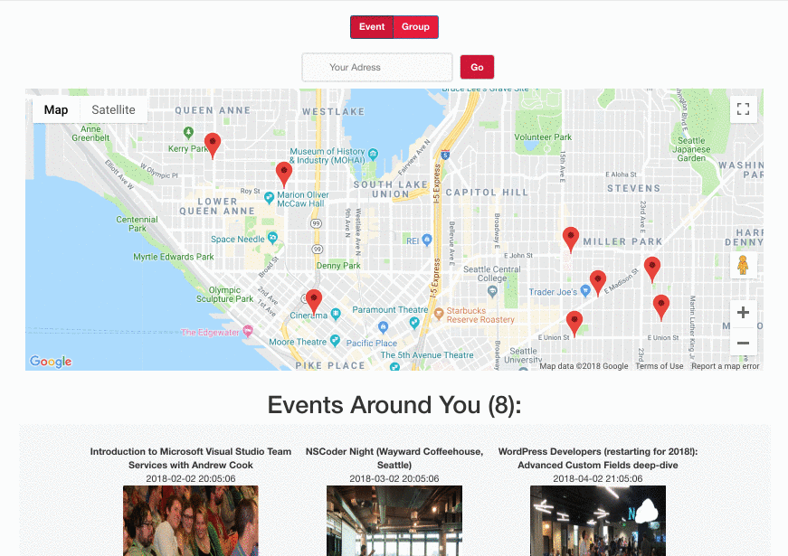
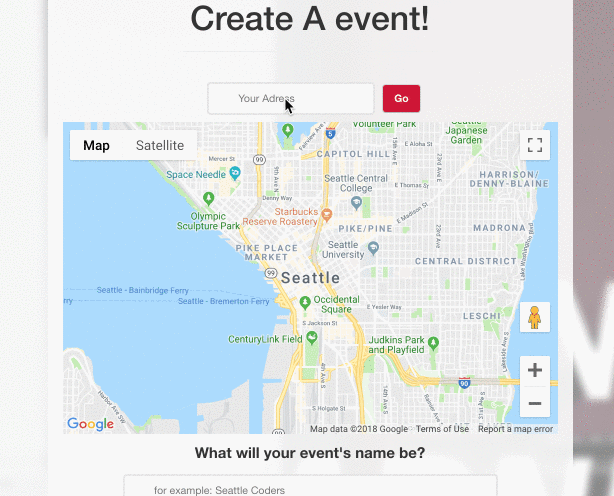
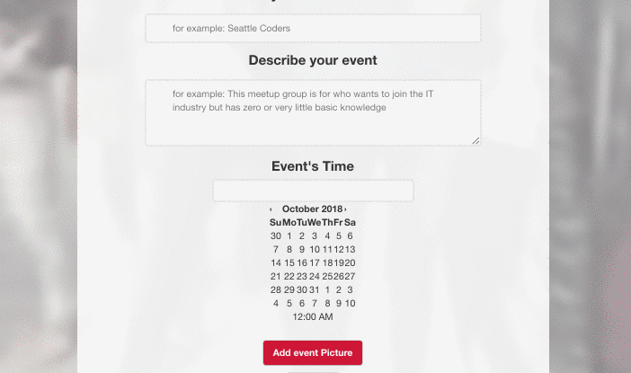
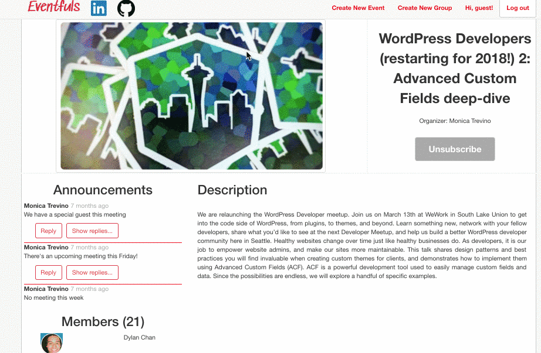

# EVENTFULS

## Demo

[Eventfuls Live Demo][1]

## Overview

Eventfuls is a full-stack web application inspired by Meetup. An online social platform aims to connect people with common interests and cultivates social connections

## Features

* Secure login credentials for users powered by BCrypt
* Make Geospatial data accessible via Google Maps API 
* Search around the world for location to mark down
* Provide interactive drag-to-scroll to engage user to navigate map
* Discussion board to facilitate interactions between group members
* Users can use drag and drop to upload photos
* Users can sign up for events and join groups

### Explore
Users can look up events in the area with the interactive map. The search result will be adjust according to the map coordinates.

In addition, users can also explore an event by selecting markers on the map.

Finally, users can lookup location by states, cities, zipcodes or even countries!

### Drag and drop image upload
Uploading event's profile picture is at ease with just drag and drop motion.

### Group discussion
Users can have latest update about group meetings from group's admin through Announcements. Members can also reply to an announcement.

## Technologies

* PostgreSQL
* Ruby on Rails
* React / Redux
* jQuery
* Cloudinary
* Google API
* Lodash
* Bootstrap

## Upcoming Changes

* User profile page
* Event/Group tag
* Event/Group edit

[1]: https://eventfuls.herokuapp.com/#/
